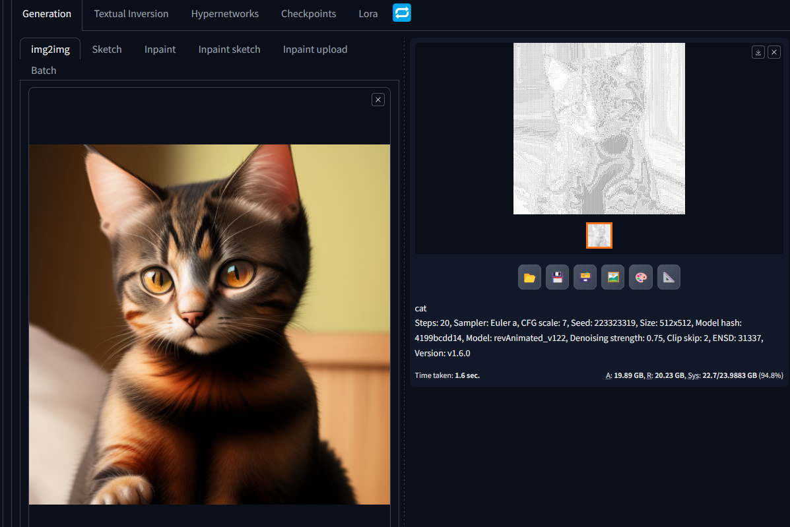
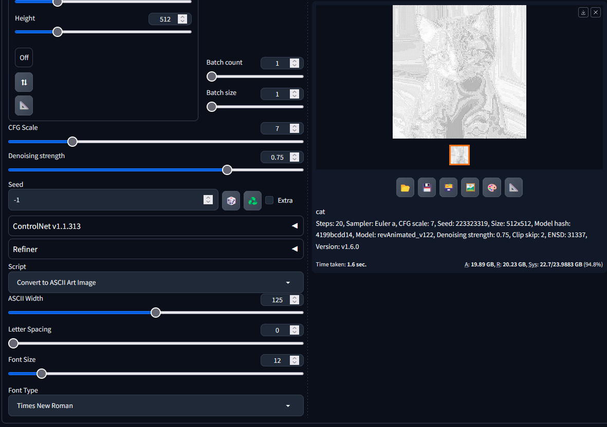

# Stable Diffusion Script to turn images into Ascii Art

ASCII Art Image Converter for Stable Diffusion Web UI

## Overview

This script allows you to convert images into ASCII art within the Stable Diffusion Web UI. It provides a user interface to adjust various parameters like ASCII width, letter spacing, font size, and font type. The script is designed to be used as an add-on script for the Stable Diffusion Web UI and can be found in the IMG2IMG section.

## Installation

1. Place the `asciiImage.py` script into the `stable-diffusion-webui/scripts` directory of your Stable Diffusion Web UI installation.

## Usage

1. Open the Stable Diffusion Web UI and navigate to the IMG2IMG section.
2. At the bottom of the IMG2IMG section, you'll find a dropdown for selecting scripts.
3. Select "Convert to ASCII Art Image" from the dropdown to activate the script.

### Parameters

- **ASCII Width**: Adjusts the width of the ASCII art. Range: 50-200.
- **Letter Spacing**: Adjusts the spacing between ASCII characters. Range: 0-20.
- **Font Size**: Adjusts the font size of the ASCII characters. Range: 8-48.
- **Font Type**: Allows you to select different fonts for the ASCII art. Options include "default", "Arial", "Courier New", "Times New Roman", "Comic Sans MS", and "Verdana". - these are on most windows machine already, if you don't have a certain font the default is used automaticlly 

## License

This script is open-source and free to use. For any issues or contributions, please open a GitHub issue or pull request.

